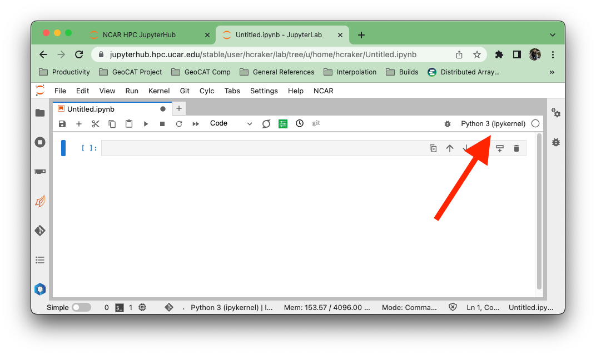
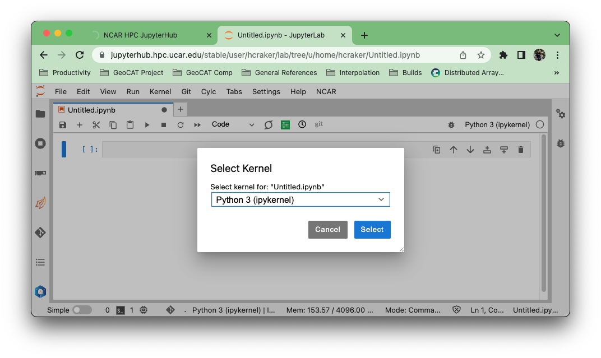
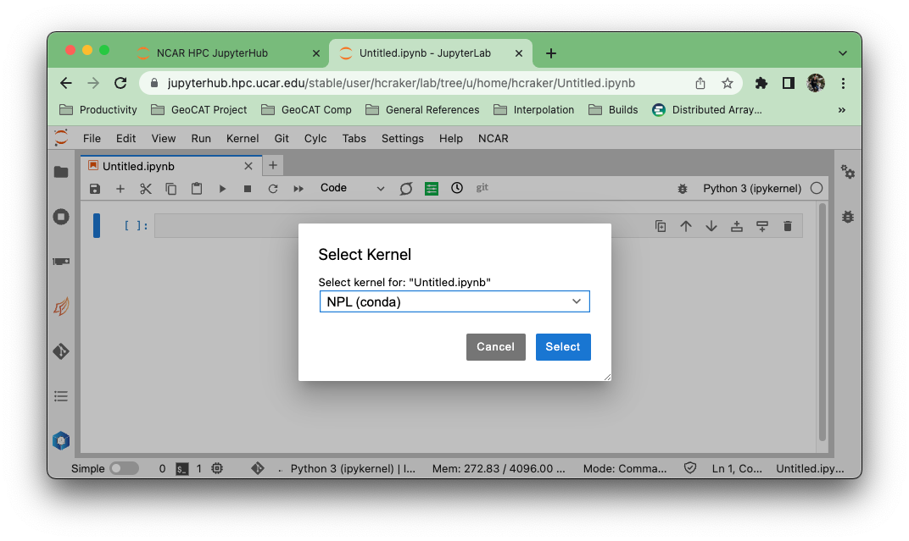

# Frequently Asked Questions

This contains relevant questions and answers from common workflow issues and questions posted on Zulip.

**_This page is meant to be a list of FAQ regarding climate datasets, movivated by a variety of employees across UCAR/NCAR_**

## I need help with this!

### Where do I go for help?

Try one of the following resources.

1. Xarray's [How Do I do X?](https://xarray.pydata.org/en/stable/howdoi.html) page
2. [Xarray Github Discussions](https://github.com/pydata/xarray/discussions)
3. [Pangeo Discourse Forum](https://discourse.pangeo.org)
4. NCAR Zulip under #python-questions, #python-dev, or #dask.

Avoid personal emails and prefer a public forum.

### What do I do if my question is not answered on this page?

If your question is related to conda environments and you're affiliated with UCAR/NCAR,
you can open a help ticket on the [NCAR Research Computing Helpdesk site](https://ithelp.ucar.edu/plugins/servlet/desk/site/rc).
If your issue is related to data science packages and workflows, you can open an issue
[on our GitHub here](https://github.com/NCAR/esds/issues) or book an
[office hour appointment](https://ncar.github.io/esds/office-hours/) with an ESDS core member!

## Someone must have written the function I want. Where do I look?

See the xarray [ecosystem](https://xarray.pydata.org/en/latest/ecosystem.html) page. Also see the [xarray-contrib](https://github.com/xarray-contrib/) and [pangeo-data](https://github.com/pangeo-data) organizations. Some NCAR relevant projects include:

1. [GeoCAT-comp](https://geocat-comp.readthedocs.io/en/latest/)
1. [GeoCAT-viz](https://geocat-viz.readthedocs.io/en/latest/)
1. [cf_xarray](https://cf-xarray.readthedocs.io/en/latest/)
1. [climpred](https://climpred.readthedocs.io/en/stable/)
1. [eofs](https://ajdawson.github.io/eofs/latest/)
1. [MetPy](https://unidata.github.io/MetPy/latest/index.html)
1. [rechunker](https://rechunker.readthedocs.io/en/latest/)
1. [xclim](https://xclim.readthedocs.io/en/stable/)
1. [xesmf](https://xesmf.readthedocs.io/en/latest/)
1. [xgcm](https://xgcm.readthedocs.io/en/latest/)
1. [pop-tools](https://pop-tools.readthedocs.io/en/latest/)
1. [xskillscore](https://xskillscore.readthedocs.io/en/stable/index.html)

## How do I use conda environments?

### General Advice

Dealing with Python environments can be tricky... a good place to start is to checkout
[this guide on dealing with Python environments](https://whiteboxml.com/blog/the-definitive-guide-to-python-virtual-environments-with-conda).
If you just need a refresher on the various conda commands, this [conda cheet sheet](https://docs.conda.io/projects/conda/en/latest/_downloads/843d9e0198f2a193a3484886fa28163c/conda-cheatsheet.pdf)
is a wonderful quick reference.

### Using conda on NCAR HPC resources

```{Warning}

Since 12 December 2022, it is no longer recommended to install your own version of miniconda on the HPC system.
To export your existing environments to the recommended installation of miniconda, refer to the "How can I export my environments?" section.

```

The NCAR High Performance Computing (HPC) system has a conda installation for you to use. The most recent and detailed
instructions can be found on this [Using Conda and Python](https://arc.ucar.edu/knowledge_base/83853599) page.

If you don't want the trouble of making your own conda environment, there are managed environments available. The NCAR
Package Library (NPL) is an environment containing many common scientific Python pacakges such as Numpy, Xarray, and GeoCAT.
You can access the NPL environment through the command line and the NCAR JupyterHub.

#### NPL on the command line

1. Open up a terminal in Casper or Cheyenne
2. Load the NCAR conda module:

   ```bash
   $ module load conda/latest
   ```

3. List the available NCAR managed environments:

   ```bash
   $ conda env list

      base                  *  /glade/u/apps/opt/conda
      npl                      /glade/u/apps/opt/conda/envs/npl
      npl-2022b                /glade/u/apps/opt/conda/envs/npl-2022b
      npl-2206                 /glade/u/apps/opt/conda/envs/npl-2206
      npl-2207                 /glade/u/apps/opt/conda/envs/npl-2207
      pygpu-dask               /glade/u/apps/opt/conda/envs/pygpu-dask
   ```

4. Activate the environment you want to use. Here we are using the `npl` environment as an example. `npl` can be replaced
   with any available environment name:

   ```bash
   $ conda activate npl
   ```

5. Now when you run a script, the modules within the `npl` environment will be available to your program.

#### NPL on the NCAR JupyterHub

1. Log in to the Production [NCAR JupyterHub](https://jupyterhub.hpc.ucar.edu/)
2. Start a [server](https://arc.ucar.edu/knowledge_base/70549913)
3. With your Jupyter Notebook open, click on the kernel name in the upper right.
   
4. A dialog will appear with all the verious kernels available to you. These kernels will (generally) have the same
   name as the conda environment that it uses. This may not be the case if you are managing your own environments and kernels.
   
5. Select the "npl (conda)" kernel from the list if you want to use the NCAR-managed NPL environment.
   

### Creating and accessing a new conda environment on the NCAR JupyterHub

You may want to move past using NPL, and create a new conda environment!
For detailed instructions, check out the [Using Conda and Python](https://arc.ucar.edu/knowledge_base/83853599) page on
the NCAR Advanced Research Computing site. Heres a summary of the basic steps:

1. Create the environment

   If you are creating an environment from scratch, use the following:

   ```bash
   conda create --name my_environment
   ```

   where `my_environment` is the name of your environment

   Ff you have an environment file (ex. `environment.yml`), use the following:

   ```bash
   conda env create -f environment.yml
   ```

2. Activate your environment and install the `ipykernel` package

   ```bash
   conda activate my_environment.yml
   conda install ipykernel
   ```

   ```{Note}

   The [`ipykernel`](https://github.com/ipython/ipykernel) package is required for your environment to be available from the NCAR [JupyterHub](https://jupyterhub.hpc.ucar.edu/)

   ```

3. Accessing your conda environment

   Your environment should now automatically show up as an available kernel in any Jupyter server on the NCAR HPC systems.
   If you want to give your kernel a name that is different from the environment name, you can use the following command:

   ```bash
   python -m ipykernel install --user --name=my-kernel
   ```

   Where `my-kernel` is the kernel name.

### Conda is taking too long to solve environment: use mamba

This is a very common issue when installing a new package or trying to update a package in an existing conda environment. This issue is usually manifested in a conda message along these lines:

```bash
environment Solving environment: failed with initial frozen solve. Retrying with flexible solve.
```

One solution to this issue is to use [`mamba`](https://mamba.readthedocs.io/en/latest/user_guide/concepts.html) which is a drop-in replacement for conda. Mamba aims to greately speed up and improve conda functionality such as solving environment, installing packages, etc...

- Installing Mamba

```bash
conda install -n base -c conda-forge mamba
```

- Set `conda-forge` and `nodefaults` channels

```bash
conda config --add channels nodefaults
conda config --add channels conda-forge
```

- To install a package with mamba, you just run

```bash
mamba install package_name
```

- To create/update an environment from an environment file, run:

```bash
mamba env update -f environment.yml
```

```{Note}
We do not recommend using `mamba` to activate and deactivate environments as this can cause packages to misbehave/not load correctly.
```

See [mamba documentation](https://mamba.readthedocs.io/en/latest/index.html) for more.

### How can I export my environments?

If you made an environment on one machine or using a different conda installation, you can export that environment
and use it elsewhere. These are the basic steps:

1. Export your environment

   With the environment you want to export activated, run the following command:

   ```bash
   conda env export --from-history > environment.yml
   ```

   where `environment` can be replaced with the file name of your choice. The `--from-history` flag allows you to
   recreate your environment on any system. It is the cross-platform compatible way of exporting an environment.

2. Move the `environment.yml` to the system you want to use it on / activate the appropriate conda installtion you wish to use.

3. Use the `.yml` file to create your environment
   ```bash
   conda env create -f environment.yml
   ```

## Xarray and Dask

### General tips

1. Read the xarray documentation on [optimizing workflow with dask](https://xarray.pydata.org/en/stable/dask.html#optimization-tips).
1. Read the [Best practices for dask array](https://docs.dask.org/en/stable/array-best-practices.html)
1. Keep track of chunk sizes throughout your workflow. This is especially important when reading in data using `xr.open_mfdataset`. Aim for 100-200MB size
   chunks.
1. Choose chunking appropriate to your analysis. If you're working with time series then chunk more in space and less along time.
1. Avoid indexing with `.where` as much as possible. In particulate `.where(..., drop=True)` will trigger a compute since it needs
   to know where NaNs are present to drop them. Instead see if you can write your statement as a `.clip`, `.sel`, `.isel`, or
   `.query` statement.

### How do I optimize reading multiple files using Xarray and Dask?

A good first place to start when reading in multiple files is [Xarray's multi-file documentation](https://xarray.pydata.org/en/stable/io.html#reading-multi-file-datasets).

For example, if you are trying to read in multiple files where you are interested in concatenating over the time dimension, here is an example of the `xr.open_dataset` line would look like:

```python
ds = xr.open_mfdataset(
        files,
        # Name of the dimension to concatenate along.
        concat_dim="time",

        # Attempt to auto-magically combine the given datasets into one by using dimension coordinates.
        combine="by_coords",

        # Specify chunks for dask - explained later
        chunks={"lev": 1, "time": 500},

        # Only data variables in which the dimension already appears are included.
        data_vars="minimal",

        # Only coordinates in which the dimension already appears are included.
        coords="minimal",

        # Skip comparing and pick variable from first dataset.
        compat="override",
        parallel=True,
    )
```

### Where can I find Xarray tutorials?

See [videos](https://xarray.pydata.org/en/latest/tutorials-and-videos.html) and [notebooks](https://xarray-contrib.github.io/xarray-tutorial/).

### How do I debug my code when using dask?

An option is to use `.compute(scheduler="single-threaded")`. This will run your code as a serial for loop. When an error is raised you can use the `%debug`
magic to drop in to the stack and debug from there. See [this post](https://cherian.net/posts/python-debugging.html) for more debugging tips
in a serial context.

### `KilledWorker` X{. What do I do?

Keep an eye on the dask dashboard.

1. If a lot of the bars in the Memory tab are orange, that means your workers are running out of memory. Reduce your chunk size.

### Help, my analysis is slow!

1. Try subsetting for **_just_** the variable(s) you need for example, if you are reading in a dataset with ~25 variables, and you only need `temperature`, just read in temperature. You can specificy which variables to read in by using the following syntax, following the example of the temperature variable.

```python
ds = xr.open_dataset(file, data_vars=['temperature'])
```

1. Take a look at your chunk size, it might not be optimized. When reading a file in using Xarray with Dask, a "general rule of thumb" is to keep your chunk size down to around 100 mb.

For example, let's say you trying to read in multiple files, each with ~600 time steps. This is case where each file is very large (several 10s of GB) and using Dask to help with data processing is _essential_.

You can check the size of each chunk by subsetting a single DataArray (ex. `ds['temperature']`)

If you have very large chunks, try modifying the number of chunks you specify within `xr.open_mfdataset(files, ..., chunks={'lev':1, "time": 500})` where lev and time are vertical and time dimensions respectively.

Check to see how large each chunk is after modifying the chunk size, and modify as necessary.

1. You do not have enough dask workers

If you have a few large files, having the number of workers equal to to the number of input files read in using `xr.open_mfdataset` would be a good practice

If you have a large number of smaller files, you may not run into this issue, and it is suggest you look at the other potential solutions.

### I have to do lots of rechunking, but the rechunk step uses too much memory and kills my workers.

Try the [rechunker package](https://github.com/pangeo-data/rechunker).

### Writing to files in parallel

Distributed writes to netCDF are hard.

1. Try writing to `zarr` using `Dataset.to_zarr`.
1. If you need to write to netCDF and your final dataset can fit in memory then use `dataset.load().to_netcdf(...)`.
1. If you really must write a big dataset to netCDF try using `save_mfdataset` (see [here](https://ncar.github.io/xdev/posts/writing-multiple-netcdf-files-in-parallel-with-xarray-and-dask/)).

### My Dask workers are taking a long time to start. How can I monitor them?

Dask worker requests are added to the job queues on Casper and Cheyenne with the `cluster.scale()` method. After this method is called, you can verify that they are waiting in the queue with this command:

- `qstat -u <my_username>` on Cheyenne, and the same command will work on Casper after April 2021.

If you see no pending worker jobs, then verify that you have called `cluster.scale()`.

## Github

### Setting up Github Authentication

Beginning August 13, 2021, Github will no longer accept account passwords when authenticating git operations. There are essentially two options, which Github provides proper documentation for getting setup:

1. [Setup two-factor authentication](https://docs.github.com/en/github/authenticating-to-github/securing-your-account-with-two-factor-authentication-2fa)
1. [Connect to Github via SSH](https://docs.github.com/en/github-ae@latest/github/authenticating-to-github/connecting-to-github-with-ssh)

## CESM Data

### Dealing with CESM monthly output - is there something wrong with time

A well known issue of CESM data is that timestamps for fields saved as averages are placed at the end of the averaging period. For instance, in the following example, the `January/1920` average has a timestamp of `February/1920`:

```python
In [25]: filename = '/glade/collections/cdg/data/cesmLE/CESM-CAM5-BGC-LE/atm/proc/tseries/monthly/TS/b.e11.B20TRC5CNBDRD.f09_g16.011.cam.h0.TS.192001-200512.nc'

In [33]: ds = xr.open_dataset(filename)

In [34]: ds.time
Out[34]:
<xarray.DataArray 'time' (time: 1032)>
array([cftime.DatetimeNoLeap(1920, 2, 1, 0, 0, 0, 0),
       cftime.DatetimeNoLeap(1920, 3, 1, 0, 0, 0, 0),
       cftime.DatetimeNoLeap(1920, 4, 1, 0, 0, 0, 0), ...,
       cftime.DatetimeNoLeap(2005, 11, 1, 0, 0, 0, 0),
       cftime.DatetimeNoLeap(2005, 12, 1, 0, 0, 0, 0),
       cftime.DatetimeNoLeap(2006, 1, 1, 0, 0, 0, 0)], dtype=object)
Coordinates:
  * time     (time) object 1920-02-01 00:00:00 ... 2006-01-01 00:00:00
Attributes:
    long_name:  time
    bounds:     time_bnds
```

A temporary workaround is to fix the issue ourselves by computing new time axis by averaging the time bounds:

```python
In [29]: import xarray as xr

In [30]: import cf_xarray # use cf-xarray so that we can use CF attributes

In [31]: filename = '/glade/collections/cdg/data/cesmLE/CESM-CAM5-BGC-LE/atm/proc/tseries/monthly/TS/b.e11.B20TRC5CNBDRD.f09_g16.011.cam.h0.TS.192001-200512.nc'

In [32]: ds = xr.open_dataset(filename)

In [34]: attrs, encoding = ds.time.attrs.copy(), ds.time.encoding.copy()

In [36]: time_bounds = ds.cf.get_bounds('time')

In [37]: time_bounds_dim_name = ds.cf.get_bounds_dim_name('time')

In [38]: ds = ds.assign_coords(time=time_bounds.mean(time_bounds_dim_name))

In [39]: ds.time.attrs, ds.time.encoding = attrs, encoding

In [40]: ds.time
Out[40]:
<xarray.DataArray 'time' (time: 1032)>
array([cftime.DatetimeNoLeap(1920, 1, 16, 12, 0, 0, 0),
       cftime.DatetimeNoLeap(1920, 2, 15, 0, 0, 0, 0),
       cftime.DatetimeNoLeap(1920, 3, 16, 12, 0, 0, 0), ...,
       cftime.DatetimeNoLeap(2005, 10, 16, 12, 0, 0, 0),
       cftime.DatetimeNoLeap(2005, 11, 16, 0, 0, 0, 0),
       cftime.DatetimeNoLeap(2005, 12, 16, 12, 0, 0, 0)], dtype=object)
Coordinates:
  * time     (time) object 1920-01-16 12:00:00 ... 2005-12-16 12:00:00
Attributes:
    long_name:  time
    bounds:     time_bnds
```

```{Note}

cf-xarray can be installed via pip or conda. cf-xarray docs are available [here](https://cf-xarray.readthedocs.io/en/latest/).

```
