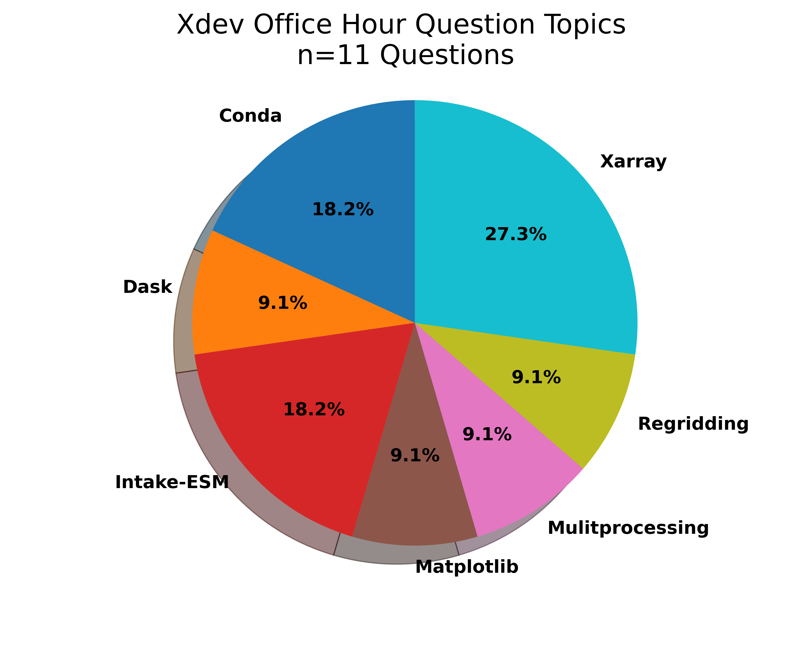

# ESDS Update November 2021

November was an active month! There were a couple of ESDS Forum talks, a variety of answered Python questions during office hours, and a Python tutorial!

Check out the following ESDS update for the month of November 2021.

## Xdev Updates

Xdev has continued to make progress on the **_Funnel_** project; this extends the data catalog with "analysis recipes", providing an effective strategy for modularization and extensibility of workflows.

The [esds-funnel](https://github.com/NCAR/esds-funnel) provides the caching framework, while the [esm-collections](https://github.com/NCAR/esm-collections) repository is where we prototype the full workflows with the catalogs and analysis recipes.

We have continued to push forward on the `xwrf` project, which aims to help bring the Weather Research and Forecasting (WRF) model into the Pangeo ecosystem. Be sure to follow the [`xwrf` repository](https://github.com/NCAR/xwrf) for updates.

## ESDS Forum

### Python Package Overviews

- [Introducing Project Raijin Community Geoscience Analysis Tools for Unstructured Mesh Data](https://raijin.ucar.edu/) (29 November 2021) - Orhan Eroglu (CISL)

### General Discussion

- [An Open Discussion Around Earth System Prediction at NCAR](https://docs.google.com/forms/d/e/1FAIpQLScX4ugyocLz1WgIthzX_eN_CXkBR7QvlHTS0eMLxFtxsjxPyw/viewform?vc=0&c=0&w=1&flr=0) (01 November 2021) - Matt Long (CGD)

## ESDS Blog Posts

### Data Computation

- [Correctly Calculating Annual Averages with Xarray](https://ncar.github.io/esds/posts/2021/yearly-averages-xarray/)

### End to End Workflow

- [Processing Data from the NCAR Mesa Lab Weather Station¶](https://ncar.github.io/esds/posts/2021/weather-station-data-preprocess/)

## Office Hour Questions

During the month of October 2021, our team answered a total of **10 questions** at our weekly [Xdev Office Hours](https://ncar.github.io/esds/calendar/#xdev-office-hours).

Below is a summary of the most common questions brought up during office hours!

### Matplotlib Questions

- How do you make boxplots with two datasets of varying sizes?
  - **Solution**: Called `plt.boxplot()` twice, use `width = 0.1` for both calls and `positions=[1.5,2.5,3.5,4.5]` for the second call.

### Dask Questions

- How do you run Dask on Casper?
  - **Solution**: Encouraged use of [`ncar-jobqueue`](https://github.com/NCAR/ncar-jobqueue) package, using the compute nodes on Casper.

### Xarray Questions

- How do you load multiple files into xarray and plot the output?

  - **Solution**: Had to call .load() and .some_variable in order to access the shape, pointed to [xarray and dask section on ESDS FAQ page](https://ncar.github.io/esds/faq/#xarray-and-dask).

- How do you drop specific dates from a dataset?
  - **Solution**: Used cftime_range() along with sel_drop()

### Conda Questions

- How do you uninstall and reinstall a conda environment?

  - **Solution**: Encouraged to check out the [anaconda docs about deleting environment](https://docs.anaconda.com/anaconda/install/uninstall/) and reinstall environment.

- How do you make sure your conda environment is activated upon opening terminal?
  - **Solution**: Added a new section walking through this process called ["Activating Your Base Environment Upon Opening a Terminal"](https://ncar.github.io/esds/faq/#conda-environments)

## Python Tutorial(s)

### [Object Oriented Programming Tutorial](https://ncar.github.io/esds/posts/2021/oop-tutorial/)

<iframe width="560" height="315" src="https://www.youtube.com/embed/zlHkkjr7e6k" title="YouTube video player" frameborder="0" allow="accelerometer; autoplay; clipboard-write; encrypted-media; gyroscope; picture-in-picture" allowfullscreen></iframe>
