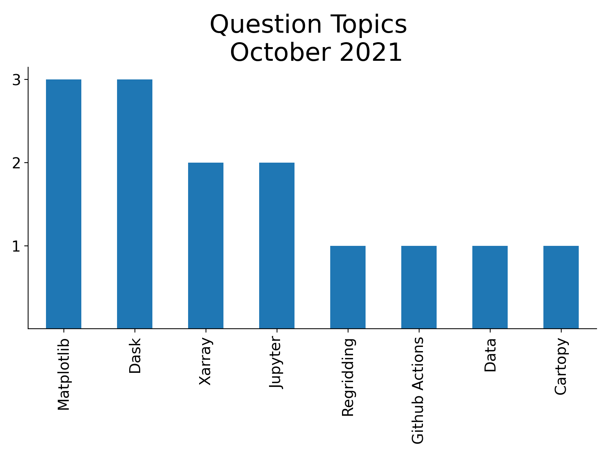

# ESDS Update October 2021

October has been an active month! There were a variety of talks, a variety of answered Python questions during office hours, and a Python tutorial!

Check out the following ESDS update for the month of October 2021.

## ESDS Forum

### Python Package Overviews

- [A Jupyter Based Diagnostics Prototype](https://docs.google.com/presentation/d/1pWzVrPvNsYMjM4WqqXYophEOVz3XZjeJ5DHdqPY_3S8/edit?usp=sharing) (4 October 2021) - Max Grover (CGD)

### General Discussion

- [An Overview of Xdev and Analysis Pain Points](https://docs.google.com/forms/d/e/1FAIpQLScX4ugyocLz1WgIthzX_eN_CXkBR7QvlHTS0eMLxFtxsjxPyw/viewform?vc=0&c=0&w=1&flr=0) (18 October 2021) - Kevin Paul (CISL)

## ESDS Blog Posts

### Data Computation

- [Using Intake-ESM's New Derived Variable Functionality](https://ncar.github.io/esds/posts/2021/intake-esm-derived-variables/)

### End to End Workflow

- [CESM2-Large Ensemble Reproduction of a Figure from Kay et al. 2015 Using Intake-ESM and hvPlot](https://ncar.github.io/esds/posts/2021/kay-et-al-cesm2-le/)
- [Reading WRF data into Xarray and Visualizing the Output using hvPlot](https://ncar.github.io/esds/posts/2021/xarray-wrf-example/)

## Office Hour Questions

During the month of October 2021, our team answered a total of **14 questions** at our weekly [Xdev Office Hours](https://ncar.github.io/esds/calendar/#xdev-office-hours).

Below is a summary of the most common questions brought up during office hours!

### Matplotlib Questions

- How do you adjust the colorbar size, spacing?
  - Suggested adding to the `pad` argument
- How to plot a basic map using matplotlib?
  - Suggested checking out the [Cartopy Content on the Pythia Foundations Page](https://foundations.projectpythia.org/core/cartopy/cartopy.html)
- How do you adjust the colorbar?
  - Pointed to [matplotlib colorbar documentation](https://matplotlib.org/stable/api/_as_gen/matplotlib.pyplot.colorbar.html)

### Dask Questions

- How do you get dask to work with stacking CESM2-LE data?
  - Worked on an example subsetting the data, developing pipeline
- How to submit jobs with different schedulers?
  - Suggested checking out [Dask jobqueue options](http://jobqueue.dask.org/en/latest/)
- What is the most efficient way to compute annual means from a bunch of Earth System Prediction (ESP) data?
  - For some cases, makes sense using the preprocess function when the files are big enough (ex. ESP Decadal Prediction datasets)
    - Good case for preprocess - calculating annual means with files ~10s of GB in size
    - Bad case for preprocess - working with many smaller files, which leads to a large number of tasks and a slower process

### Xarray Questions

- How do you optimize file read in with ESP data?
  - Make sure to know when to use the preprocess function with computations
- How to use one dataset to mask another with different dims?
  - Needed to create a loop and create new dimensions for the datasets

## Python Tutorial(s)

### [Advanced Plotting Tutorial](https://ncar.github.io/esds/posts/2021/advanced-plotting-tutorial/)

<iframe width="560" height="315" src="https://www.youtube.com/embed/vyqlHdFfGWo" title="YouTube video player" frameborder="0" allow="accelerometer; autoplay; clipboard-write; encrypted-media; gyroscope; picture-in-picture" allowfullscreen></iframe>
