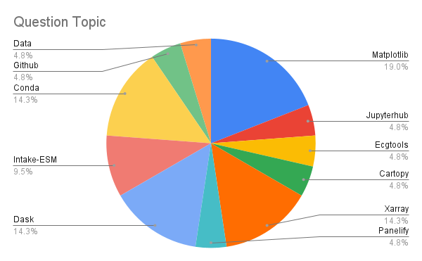
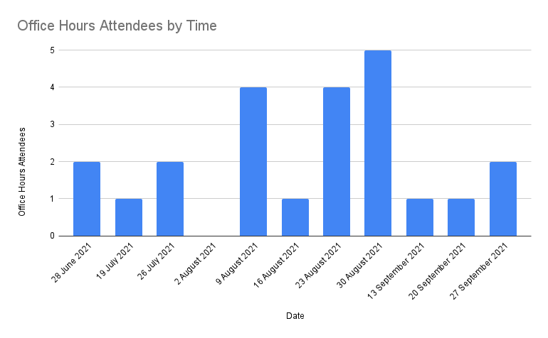

# ESDS Progress Over the Past Few Months

The first ESDS "meeting" took place in mid March 2021, with the kickoff event being the CGD town hall ([here is the blog post detailing the topics at that meeting](https://ncar.github.io/esds/posts/2021/esds-blog/)). Since that meeting, we have moved forward, holding a variety of Work in Progress talks, partnering with Xdev to offer Python Tutorials, and publish a series of blog posts aimed at documenting scientific workflows here at NCAR.

Most of our blog posts thus far have been focused on Python tutorials, workflow examples, or conference summaries. One **_new type of post_** we will be posting now are monthly summaries on ESDS activities. Since we have not posted one yet, we grouped up all of our activities since early March. Going forward, we will post on a monthly basis!

We outline some of the key points of progress over the past few months below! We also have update our vision, values, and near-term goals, accessible on our [about us](https://ncar.github.io/esds/about/) page. If you are interested in more of the details, be sure to check out the [ESDS Vision Whitepaper](https://docs.google.com/document/d/1hwl-3QpFlR8tGrLxdxZrC9edT3CeLTG9dqy6_8KupYg/edit?usp=sharing).

## Work in Progress Talks

If you are interested in the links to these talks, or the discussion points, check out the [agenda using this link](https://docs.google.com/document/d/13lpcxSWmcdeguchuGxmAG895w1HMQRexCGIxjxDZ8YQ/edit?usp=sharing)!

### Workflow Examples

- HiRes CESM MARBL repo (5 April 2021) - Mike Levy (CGD)
- SMYLE Analysis (19 April 2021) - Steve Yeager (CGD)
- Data Preprocessing and Workflows for Machine Learning (12 July 2021) - Maria Molina (CGD)
- Machine Learning at NCAR (9 August 2021) - David John Gagne (CISL)
- Oxygen Minimum Zone Analysis with Pangeo (23 August 2021) - Julius Busecke (Columbia LDEO)
- Fast parallel access to existing netCDF file collections with Zarr (20 September 2021) - Lucas Sterzinger (CISL)

### Python Package Overviews

We include links to the respective packages below!

- [CAM Diagnostics](https://github.com/NCAR/CAM_diagnostics) (5 April 2021) - Brian Medeiros (CGD)
- [An Overview of GeoCAT](https://geocat-examples.readthedocs.io/en/latest/gallery/index.html) (12 April 2021) - Orhan Eroglu (CISL)
- [An Overview of CF-Xarray](https://cf-xarray.readthedocs.io/en/latest/) (12 April 2021) - Deepak Cherian (CGD)
- [Intake-ESM](https://intake-esm.readthedocs.io/en/latest/) (10 May 2021) - Anderson Banihirwe (CISL)
- [ecgtools](https://ecgtools.readthedocs.io/en/latest/) (7 June 2021) - Max Grover (CGD)
- [GeoCAT Temporal Averaging](https://github.com/hCraker/calendar_average_demo) (7 June 2021) - Heather Craker (CISL)
- [Funnel: a prototype supporting extensible diagnostics](https://github.com/NCAR/esds-funnel) (26 July 2021) - Matt Long (CGD)
- [An Overview of MetPy](https://unidata.github.io/MetPy/latest/devel/CONTRIBUTING.html) (9 August 2021) - Ryan May and Drew Camron (Unidata)

## Office Hours

In addition to the educational content mentioned above, we have been offering weekly office hours, staffed by Xdev members.

We have had a total of **23 attendees** so far, with the most common topics being Xarray, Matplotlib, and Dask.

Recently, we have a had a slight decline in attendance, so if you are interested in finding help with your Python-oriented workflow, be sure to stop by on **Mondays at 3 PM MT**!

## Blog Posts

Over the course of the last few months, we posted a total of 23 blog posts, **not including posts related to Python tutorials**.

### Documentation and Citations

- [The Importance of Software Citation (02 April 2021)](https://ncar.github.io/esds/posts/2021/software-citation/)
- [Paired Programming using VS Code (06 May 2021)](https://ncar.github.io/esds/posts/2021/paired_programming_vs/)
- [Creating Model Documentation Using Jupyterbook and Intake-esm (25 June 2021)](https://ncar.github.io/esds/posts/2021/model_documentation_jupyterbook/)

### Data Access

- [An Example of Using Intake-ESM (09 April 2021)](https://ncar.github.io/esds/posts/2021/intake_esm_dask/)
- [Debugging Intake-ESM Process for Reading in CMIP6 (14 May 2021)](https://ncar.github.io/esds/posts/2021/intake_cmip6_debug/)
- [Building an Intake-esm catalog from CESM2 History Files (04 June 2021)](https://ncar.github.io/esds/posts/2021/ecgtools-history-files-example/)
- [Benchmarking Performance of History vs. Timeseries Files with `ecgtools`, `Intake-ESM`, and `Dask` (17 September 2021)](https://ncar.github.io/esds/posts/2021/benchmarking-history-timeseries-intake/)

### Data Computation

- [NCAR Jobqueue (15 April 2021)](https://ncar.github.io/esds/posts/2021/ncar-jobqueue-example/)
- [Using Dask on the New Casper PBS Scheduler(06 April 2021)](https://ncar.github.io/esds/posts/2021/casper_pbs_dask/)
- [How to Use `xarray.map_blocks` for Vertical Interpolation of a 3D Field (28 April 2021)](https://ncar.github.io/esds/posts/2021/map_blocks_example/)

### Data Visualization

- [Creating Visualizations of Intake-ESM Catalogs (11 June 2021)](https://ncar.github.io/esds/posts/2021/graphviz_example/)
- [Plotting CESM Data on an Unstructured Grid using `Geoviews` and `Datashader` (13 August 2021)](https://ncar.github.io/esds/posts/2021/cesm-datashader/)
- [Examining Diagnotics Using `Intake-ESM` and `hvPlot` (20 August 2021)](https://ncar.github.io/esds/posts/2021/intake-esm-holoviews-diagnostics/)
- [Regridding High Resolution Observations to a High Resolution Model Grid (10 September 2021)](https://ncar.github.io/esds/posts/2021/regrid-observations-pop-grid/)

### End to End Workflow

- [Indexing unstructured grids with the Power of Xoak (23 April 2021)](https://ncar.github.io/esds/posts/2021/multiple_index_xarray_xoak/#indexing-unstructured-grids-with-the-power-of-xoak)
- [Using Intake-ESM to Analyze Data from CESM2-LE (06 August 2021)](https://ncar.github.io/esds/posts/2021/intake-cesm2-le-glade-example/)
- [Comparing Atmospheric Model Output with Observations Using `Intake-ESM` (27 August 2021)](https://ncar.github.io/esds/posts/2021/intake-obs-cesm2le-comparison/)
- [Reimagining Diagnostics Through the Use of the Jupyter Ecosystem (24 September 2021)](https://ncar.github.io/esds/posts/2021/jupyter-based-diagnostics-overview/)

### Conference Summaries, Discussions, and Resources

- [Dask Distributed Summit 2021 Takeaways (28 May 2021)](https://ncar.github.io/esds/posts/2021/dask-summit-takeaway/)
- [CESM Diagnostics Discussion (17 June 2021)](https://ncar.github.io/esds/posts/2021/cesm-workshop-2021-diagnostics/)
- [Scaling Python with Dask Class Takeaways (02 July 2021)](https://ncar.github.io/esds/posts/2021/scaling-with-dask-class-takeaways/)
- [SciPy Conference 2021 Takeaways (26 July 2021)](https://ncar.github.io/esds/posts/2021/scipy-2021-takeaways/)
- [Pythia Portal Overview (30 July 2021)](https://ncar.github.io/esds/posts/2021/project-pythia-overview/)

## Python Tutorials

As mentioned previously, the Python Tutorial series has been on ongoing training resource, led by Julia Kent and fellow Xdevers. Below is a list of the tutorial blog posts and associated videos.

#### [Numpy Tutorial (10 March 2021)](https://ncar.github.io/esds/posts/2021/numpy-tutorial/)

<iframe width="560" height="315" src="https://www.youtube.com/embed/v=kstc-6uz7AQ" title="YouTube video player" frameborder="0" allow="accelerometer; autoplay; clipboard-write; encrypted-media; gyroscope; picture-in-picture" allowfullscreen></iframe>

#### [Matplotlib Tutorial (24 March 2021)](https://ncar.github.io/esds/posts/2021/matplotlib-tutorial/)

<iframe width="560" height="315" src="https://www.youtube.com/embed/EiPRIdHQEmE" title="YouTube video player" frameborder="0" allow="accelerometer; autoplay; clipboard-write; encrypted-media; gyroscope; picture-in-picture" allowfullscreen></iframe>

#### [Object Oriented Programming Tutorial (09 April 2021)](https://ncar.github.io/esds/posts/2021/object-oriented-programming-tutorial/)

<iframe width="560" height="315" src="https://www.youtube.com/embed/GEFnL8C62u8" title="YouTube video player" frameborder="0" allow="accelerometer; autoplay; clipboard-write; encrypted-media; gyroscope; picture-in-picture" allowfullscreen></iframe>

#### [Cartopy Tutorial (26 April 2021)](https://ncar.github.io/esds/posts/2021/cartopy-tutorial/)

<iframe width="560" height="315" src="https://www.youtube.com/embed/ivmd3RluMiw" title="YouTube video player" frameborder="0" allow="accelerometer; autoplay; clipboard-write; encrypted-media; gyroscope; picture-in-picture" allowfullscreen></iframe>

#### [Git and Github Tutorial (12 May 2021)](https://ncar.github.io/esds/posts/2021/git-and-github-tutorial/)

<iframe width="560" height="315" src="https://www.youtube.com/embed/fYkPn0Nttlg" title="YouTube video player" frameborder="0" allow="accelerometer; autoplay; clipboard-write; encrypted-media; gyroscope; picture-in-picture" allowfullscreen></iframe>

#### [Pandas Tutorial (26 May 2021)](https://ncar.github.io/esds/posts/2021/pandas-tutorial/)

<iframe width="560" height="315" src="https://www.youtube.com/embed/BsV3ek7qsiM" title="YouTube video player" frameborder="0" allow="accelerometer; autoplay; clipboard-write; encrypted-media; gyroscope; picture-in-picture" allowfullscreen></iframe>

#### [Xarray Tutorial (09 and 23 June 2021)](https://ncar.github.io/esds/posts/2021/xarray-tutorial/)

##### Part 1

<iframe width="560" height="315" src="https://www.youtube.com/embed/Ss4ryKukhi4" title="YouTube video player" frameborder="0" allow="accelerometer; autoplay; clipboard-write; encrypted-media; gyroscope; picture-in-picture" allowfullscreen></iframe>

##### Part 2

<iframe width="560" height="315" src="https://www.youtube.com/embed/2H_4drBwORY" title="YouTube video player" frameborder="0" allow="accelerometer; autoplay; clipboard-write; encrypted-media; gyroscope; picture-in-picture" allowfullscreen></iframe>

#### [Dask Tutorial (14 July and 11 August 2021)](https://ncar.github.io/esds/posts/2021/dask-tutorial/)

##### Part 1

<iframe width="560" height="315" src="https://www.youtube.com/embed/wn-QM6QUB_U" title="YouTube video player" frameborder="0" allow="accelerometer; autoplay; clipboard-write; encrypted-media; gyroscope; picture-in-picture" allowfullscreen></iframe>

##### Part 2

<iframe width="560" height="315" src="https://www.youtube.com/embed/yn4_-1pHC5k" title="YouTube video player" frameborder="0" allow="accelerometer; autoplay; clipboard-write; encrypted-media; gyroscope; picture-in-picture" allowfullscreen></iframe>

#### [GeoCAT Viz Tutorial (25 August 2021)](https://ncar.github.io/esds/posts/2021/geocat-tutorial/)

<iframe width="560" height="315" src="https://www.youtube.com/embed/It231le1fAU" title="YouTube video player" frameborder="0" allow="accelerometer; autoplay; clipboard-write; encrypted-media; gyroscope; picture-in-picture" allowfullscreen></iframe>

#### [GeoCAT Comp Tutorial (08 September 2021)](https://ncar.github.io/esds/posts/2021/geocat-comp-tutorial/)

<iframe width="560" height="315" src="https://www.youtube.com/embed/uiWDQKI8YTQ" title="YouTube video player" frameborder="0" allow="accelerometer; autoplay; clipboard-write; encrypted-media; gyroscope; picture-in-picture" allowfullscreen></iframe>
