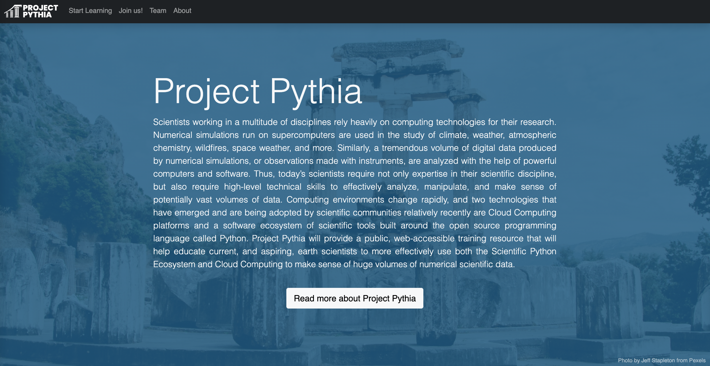
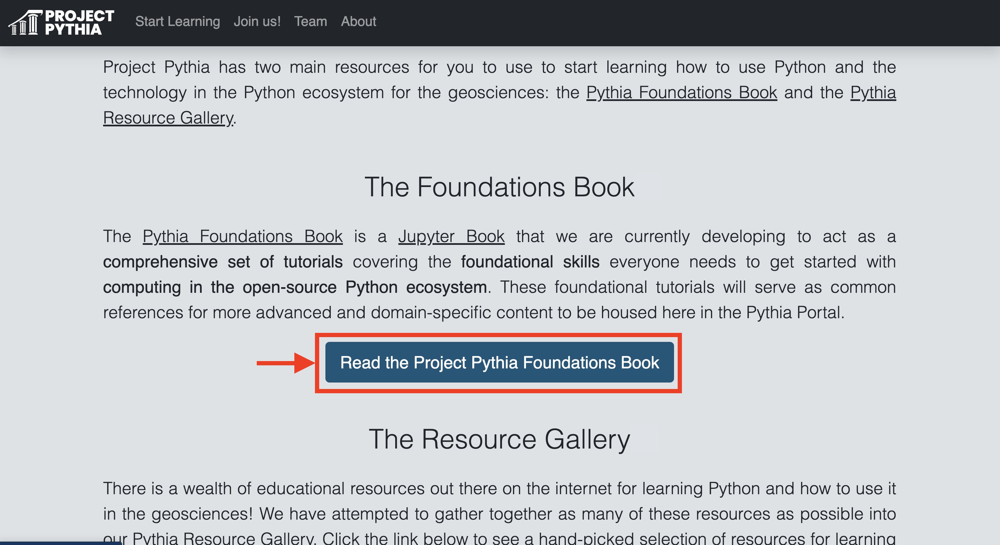
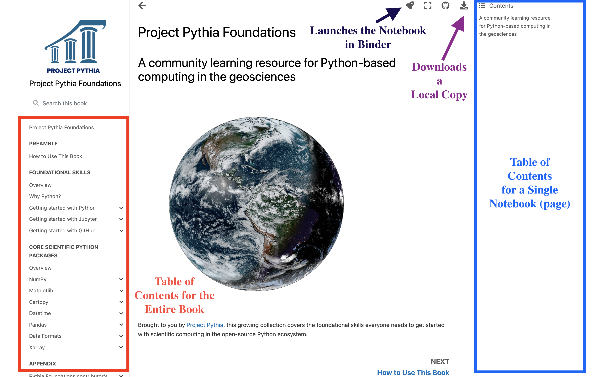
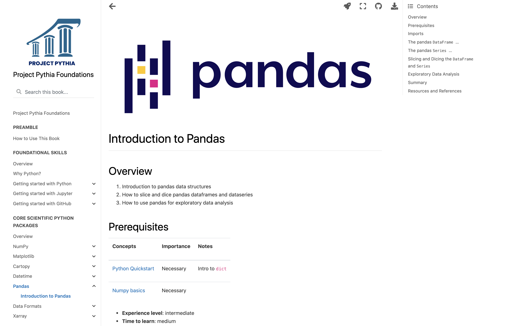
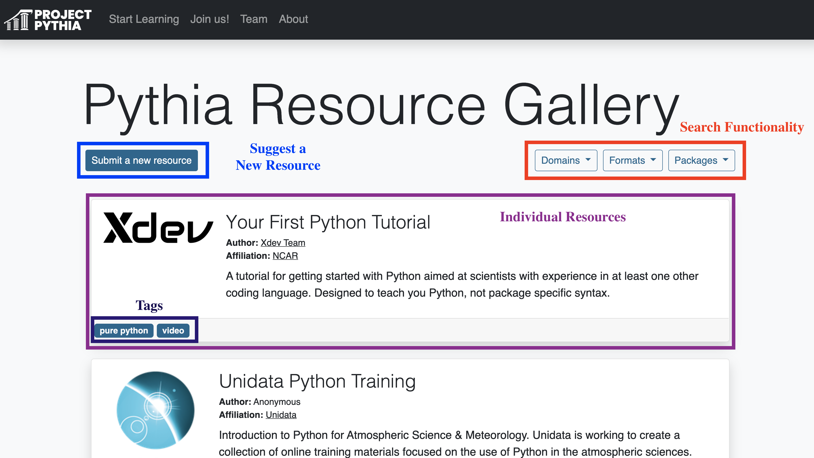
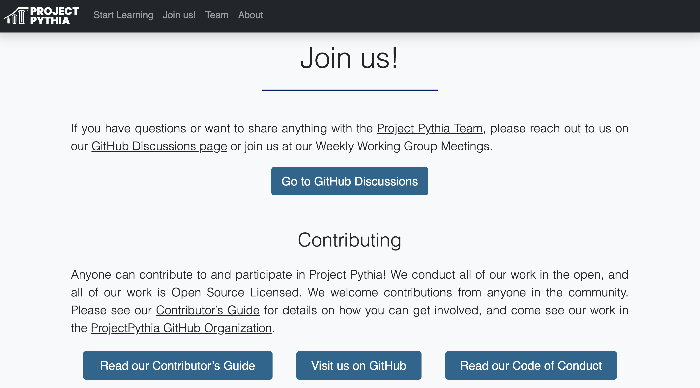
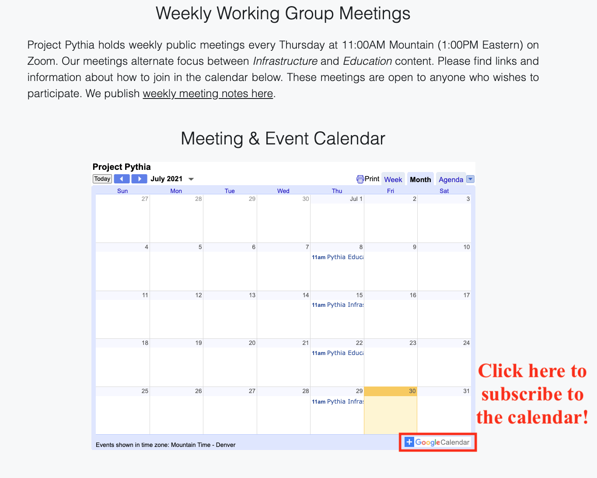

# Project Pythia Portal Overview

Last year, the Project Pythia team was formed to "provide a public, web-accessible training resource that will help educate current, and aspiring, earth scientists to more effectively use both the Scientific Python Ecosystem and Cloud Computing to make sense of huge volumes of numerical scientific data."

The team is formally a collaboration between three main organizations, although contributors come from throughout the scientific Python community:

- [The National Center for Atmospheric Research (NCAR)](https://ncar.ucar.edu/)
- [Unidata](https://www.unidata.ucar.edu/)
- [University at Albany](https://www.albany.edu/daes)

Last month, the [Project Pythia Team](https://projectpythia.org/index.html#the-project-pythia-team) presented progress on the project at the Earthcube Annual Meeting, the major milestones being the development of the [Foundations Book](https://foundations.projectpythia.org/landing-page.html) and the [Resource Gallery](https://projectpythia.org/gallery.html).

## The Pythia Portal

The main landing page for Project Pythia is known as the ["Pythia Portal"](https://projectpythia.org/index.html#).

The main page provides an overview of the project, including the motivation and a summary of what the goals of this project are. What you will see on the Portal is described below.

### Start Learning

The next section is ["Start Learning"](https://projectpythia.org/index.html#start-learning), from which both the [Foundations Book](https://foundations.projectpythia.org/landing-page.html) and the [Resource Gallery](https://projectpythia.org/gallery.html) can be accessed.

#### [Foundations Book](https://foundations.projectpythia.org/landing-page.html)

The [Foundations Book](https://foundations.projectpythia.org/landing-page.html) is one of the major milestones that the Project Pythia team has accomplished thus far. This is the place to go if you are looking for content related to foundational Python for the Geosciences.

Clicking on the link on the Pythia Portal will take you to the JupyterBook containing the instructional material - this can also be accessed using [foundations.projectpythia.org](https://foundations.projectpythia.org/landing-page.html).

Once within the [Foundations Book](https://foundations.projectpythia.org/landing-page.html), you will see the typical [Jupyterbook](https://jupyterbook.org/intro.html) interface with a few primary sections.

Each notebook is its own "page", separated into sections outlined in the table of contents which can be found along the left sidebar. On the right side of the page is the table of contents for a single notebook, which is determined using the header information in each notebook. This can be useful when wanting to navigate to specific section of a notebook.

These notebooks are executable - which is what makes this [Jupyterbook](https://jupyterbook.org/intro.html) interface so useful! If you select the space ship button near the top of the page, the notebook will open up on [binder](https://mybinder.org/) which enables you to interactively run the Jupyter Notebook on the cloud.

If you would like to download a local copy of the notebook, select the download button in the top right corner, and select whether to download as a `PDF` or `ipynb` (notebook).

Within the foundational content notebooks, you will find that each notebook follows the same format, including the following sections:

- **Overview** - a brief overview of what is covered in that notebook
- **Prerequisites** - what material is required before diving into the content
- **Desired experience level** - the difficulty level of the notebook
- **Time to learn** - estimated time to complete notebook
- _The actual content_ - which often includes imports, and several headings (ex. `The Pandas Dataframe`)
- **Summary** - main takeaways from the notebook
- **What's next** - what is covered in additional notebooks in that section
- **Resources and references** - data references, where to find more resources

#### [Resource Gallery](https://projectpythia.org/gallery.html)

The [Resource Gallery](https://projectpythia.org/gallery.html) includes links to a variety of external (to Project Pythia) material that is useful to the Geoscience community! This is a great place to go if you are looking for additional training or reference materials or more specific examples or galleries.

If you continue scrolling down the page, you will find various ways to engage with the project, including via [Github Discussions](https://github.com/ProjectPythia/projectpythia.github.io/discussions) or by checking to the resource gallery or foundations book, using the [contributor's guide](https://projectpythia.org/contributing.html) as a reference.

If you are interested in being involved with this project, I encourage you to check out our weekly meetings, separated by working groups, which include an Education Working Group, and an Infrastructure Working Group.

We look forward to continuing to make progress on this project, and gather input from the community on how to improve our content, and entrain other contributors.
