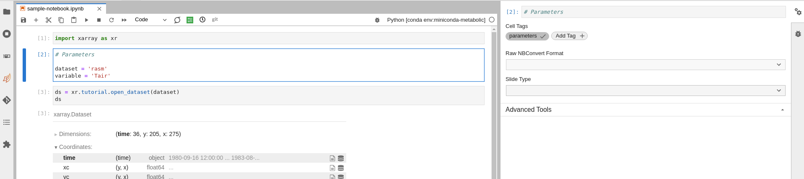
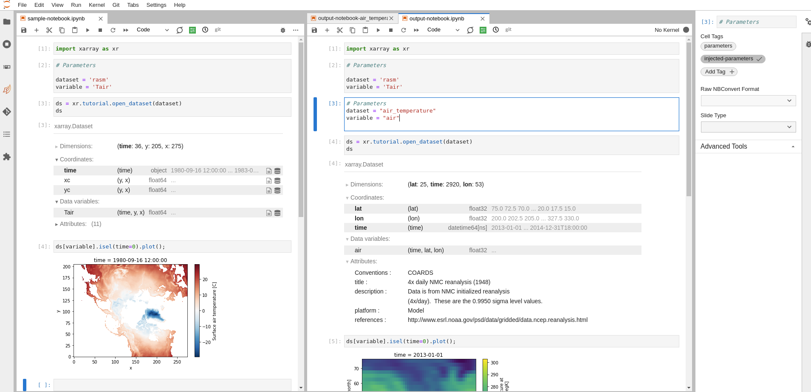

# Batch Processing Jupyter Notebooks with Papermill

## Background and Motivation

[Jupyter notebooks](https://jupyter.org/) are really good for doing the heavy lifting of data analysis by:

- Allowing you to showcase your work in a single place. You can see the complete "paper trail" of what was done. This includes the code, results, visuals and the narrative accompanying your analysis.

- Allowing others to easily use your work as a starting point for their own analysis. A new user can run cell by cell through the notebook to better get an understanding of the code.

However, Jupyter notebooks have a few drawbacks:

- Jupyter notebooks are difficult to maintain and reuse. Unlike a regular Python module that you can import and use in any Python project, users are copying and pasting snippets from each other's notebooks, and it's very easy to get out of sync.
- Jupyter notebooks are hard to parameterize. This makes it difficult to maintain one version of the truth that can be used as a notebook template for exploring different parameters. Parameters in this context correspond to different variables/arguments that you want to feed to your notebook whenever you run it.
- Unlike a regular Python scripts that can be run from the command line, running a Jupyter notebook in batch mode requires additional setup and configuration.

Some of these drawbacks can be addressed with the help of Papermill.

## What is Papermill?

[**Papermill**](https://papermill.readthedocs.io/en/latest/) is a Python library that aims to allow users to run and parametrize Jupyter notebooks in a way that is easy to maintain and reuse. In this post, we will walk through how to use Papermill's approach to parametrize a notebook that loads an Xarray dataset and plots a map of the data.

## How to use Papermill

### Step 1: Prepare the notebook

To transform your notebook into a Papermill-enabled notebook (a notebook that can be run with Papermill), you need to add the `parameters` tag to cells that contains the parameters you intend to parametrize when running the notebook with Papermill:

1. Select the cell to parameterize
2. Click the property inspector in the right sidebar (double gear icon)
3. Type `parameters` in the `Add Tag +` box and hit `Enter`.



### Step 2: Prepare the execution environment

Once you are ready to run your notebook with Papermill, you need to prepare the execution environment by ensuring the following packages are installed in the enviroment from which you plan to invoke Papermill:

- [**papermill**](https://papermill.readthedocs.io/en/latest/)
- [**jupyterlab**](https://jupyterlab.readthedocs.io/en/stable/)

For demonstration purposes, we will use `mamba`/`conda` to install these packages in a new execution environment:

```bash
$ mamba create -n myenv -c conda-forge papermill ipykernel
# or
$ conda create -n myenv -c conda-forge papermill ipykernel
```

```{note}
There are no restrictions on the environment in which you can run Papermill. You can use any environment that you like (e.g. the same environment used by your notebook).
```

Once your environment is ready, you need to ensure the Jupyter kernel used by your notebook is properly configured by running the following commands:

```bash
$ conda activate my-analysis-env
$ python3 -m ipykernel install --user --name my-analyis-env
```

### Step 3: Running the notebook

Now that you have the environment ready and the notebook is parametrized, you can run the notebook. There are two ways to run the notebook:

#### Option 1: from the command line

To run the notebook from the command line, you need to run the following command

```bash
$ conda activate myenv
$ papermill sample-notebook.ipynb output-notebook.ipynb -p dataset air_temperature -p variable air -k my-analysis-env
```

which returns the following output:

```bash
Input Notebook:  sample-notebook.ipynb
Output Notebook: output-notebook.ipynb
Executing:   0%|                                                                                                                                   | 0/6 [00:00<?, ?cell/s]Executing notebook with kernel: my-analysis-env
Executing: 100%|███████████████████████████████████████████████████████████████████████████████████████████████████████████████████████████| 6/6 [00:05<00:00,  1.05cell/s]
```

When inspecting the output notebook, you will notice that Papermill has added a cell that contains the parameters that were used to run the notebook (e.g. `air_temperature` and `air`). Attached is a screenshot of the original notebook and the output notebook side by side.



#### Option 2: from another Python script or Jupyter notebook

To run the notebook from another Python script or Jupyter notebook, you need to use the `papermill.execute_notebook` function.

```python
# contents of `papermill_runner.py`
import papermill as pm

parameters = [{
    "dataset": "air_temperature",
    "variable": "air"
}, {
    "dataset": "rasm",
    "variable": "Tair"
}]

for params in parameters:
    pm.execute_notebook(
        "sample-notebook.ipynb",
        f"output-notebook-{params['dataset']}-{params['variable']}.ipynb",
        kernel_name="my-analysis-env",
        parameters=params
    )
```

Running the example above, produces two notebooks which are saved using the pair of parameters used in the notebook.

```bash
$ python papermill_runner.py
Executing:   0%|                                                                                                                                   | 0/6 [00:00<?, ?cell/s]CONDA_PREFIX=/glade/work/abanihi/opt/miniconda/envs/my-analysis-env
Executing: 100%|███████████████████████████████████████████████████████████████████████████████████████████████████████████████████████████| 6/6 [00:06<00:00,  1.06s/cell]
Executing:   0%|                                                                                                                                   | 0/6 [00:00<?, ?cell/s]CONDA_PREFIX=/glade/work/abanihi/opt/miniconda/envs/my-analysis-env
Executing: 100%|███████████████████████████████████████████████████████████████████████████████████████████████████████████████████████████| 6/6 [00:03<00:00,  1.69cell/s]
```

```bash
$ ls -ltrh
-rw-r--r--  1 abanihi ncar 102K Mar 14 14:26 sample-notebook.ipynb
-rw-r--r--  1 abanihi ncar  50K Mar 14 15:26 output-notebook.ipynb
-rw-r--r--  1 abanihi ncar  342 Mar 14 15:34 papermill_runner.py
-rw-r--r--  1 abanihi ncar  50K Mar 14 15:34 output-notebook-air_temperature-air.ipynb
-rw-r--r--  1 abanihi ncar 105K Mar 14 15:34 output-notebook-rasm-Tair.ipynb
```

```{note}
For more information on Papermill, see [the documentation](https://papermill.readthedocs.io/en/latest/).
```

## Final Thoughts

Papermill is well-suited for

- Users who would like to run a notebook template with different input values (parameters).
- Serial execution on a single node (i.e. notebooks are executed one after the other). However, you can use frameworks like Dask to parallelize the execution of code within the notebook. Features like executing the same notebook with different parameters in parallel/concurrently would require extending Papermill.
