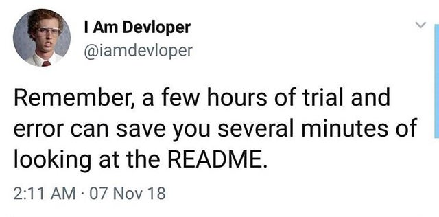
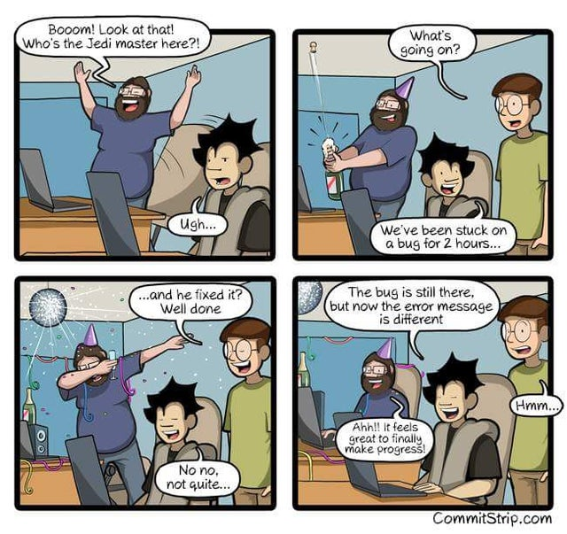
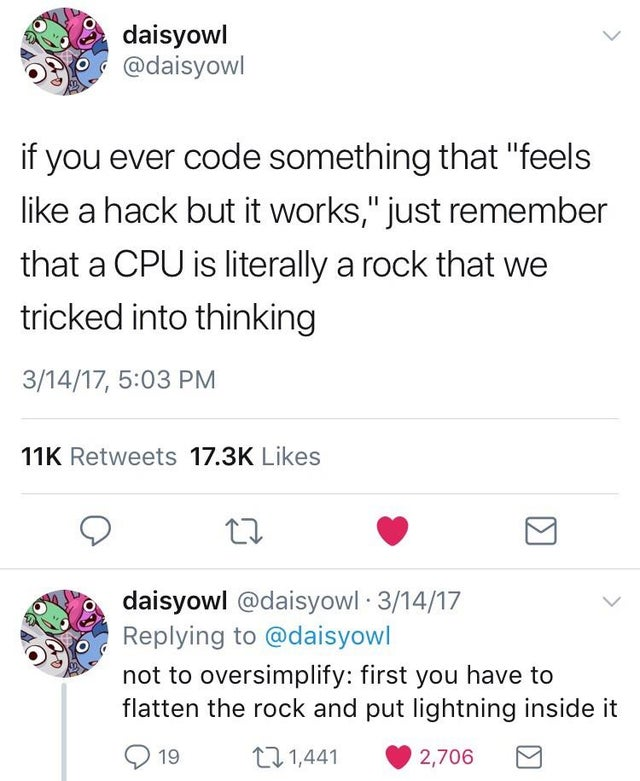

# What I’ve learned about debugging

It can be easy to get discouraged when working on a coding problem. When you think you’ve solved a problem in your code, it turns out that you misunderstood or didn’t fully grasp the root of the problem. Then, you’re facing a new coding challenge where the computer continually returns a different result than expected. This can turn into a game of cat and mouse as you chase down the bugs that are in the way of your new shiny feature being implemented.

When this happens to me, I feel disheartened and imposter syndrome creeps up - and then I can shut down, wishing that coding was easier. For me, the silver lining here is that a lot of my work is geared towards educating geoscientists to be better coders. Despite always being STEM-oriented in my passions and work, coding can be hard. This is the experience for a lot of people, and certainly is the experience for a lot of the scientists I have worked with. Reflecting on my own struggles in my own software development practices, can help me teach coding from empathetic and helpful perspectives.

I have been actively working on ways to help myself persevere through coding challenges. I’ve decided to make a list of tips and resources to make sure I’ve exhausted before I take a break and reach out for help from a peer or mentor. Hopefully, by sharing this list with you, I can help you overcome some common software development challenges.

## Search for your problem

Google and Stack Overflow are your friends! Oftentimes the task you’re trying to accomplish has given someone else a headache before, and usually their solution is documented somewhere like Stack Overflow. Of course sometimes it can be hard to know what to Google, especially if you’re using a package that shares a name with a creature -I’m looking at you Sphinx and Pandas.

But it is hard to be grumpy when this is what comes up when I search for `pandas.rolling`

<iframe src="https://giphy.com/embed/Wji7dIi2rW7fy" width="480" height="305" frameBorder="0" class="giphy-embed" allowFullScreen></iframe>
<a href="https://giphy.com/gifs/panda-roll-Wji7dIi2rW7fy">via GIPHY</a>

And of course Stack Overflow has its own share of meta-humor between the correct solution being downvoted and different problems being removed as “identicals”. Still, for most problems, Stack Overflow can help.

## Check the Documentation

Are you passing the correct Class into the function? Are you aware of all the available keyword arguments? Do the keyword arguments refer to what you think? If the documentation is good, the answer to your problem may be there. And help future-you, by updating the documentation in your code to match your updated code.

## Check the Codebase

This is similar to checking the documentation, but look at the code itself. This is especially helpful if the documentation isn’t up to snuff. Look both for the function to see if you can follow the logic of how it works and at the tests for examples of the function in action.

## Add print statements to your code

Do you know at what line your code stops working as expected? Adding print statements as simple as `print(“step X completed”)` can help you know how far your code succeeded. You should also consider printing variable values and types throughout to get further insight.

## Talk to yourself

Or a rubber duck! If you are a verbal processor, speaking through the steps of what your code is doing can help you slow down to notice when the code and your intended code don’t line up. This works even if no one is listening! You can also talk to a peer - often an extra set of eyes will immediately see a syntax error that you’ve looked at so long it has lost all meaning (But this is supposed to be a guide on how to work through errors yourself first).

## Celebrate when the error message changes

Small victories are important for keeping your momentum up. A changing error message is one step closer to understanding the error, even though it can feel like you now have to start the process all over again. The process is cyclic, but will hone into the correct solution eventually.

## Trust your intuition

Remember the ultimate goal is for your code to work. Sometimes I have an idea of what to do, but hold myself back because I worry that it is too “hacky”. Usually, my intuition was pointing me towards the right solution all along, and I was getting in my own way with thoughts of how a coder is supposed to think. Really you just want the simplest code that completes the task. If there is a cleaner or faster solution than what you come up with, the code can be refactored later. What is “hacky” anyway?

## Change your mindset

Putting on your “debugging” hat can help you be more patient with yourself and your computer. If you are too eager to implement your new feature, bugging feels like a chore. Taking a break and coming back to the debugging problem as an interesting puzzle, rather than a roadblock, can help you be less blocked in moving through and solving it.

---

If you've tried all of these methods, it might be time to reach out for help. Do you have access to office hours? Someone you can peer program with? Coding is hard, and that's okay. Good luck and happy coding!
