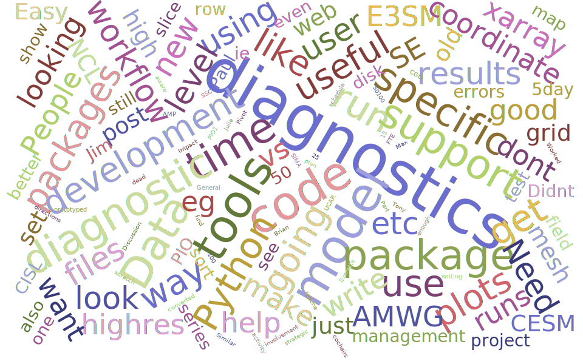

# CESM Diagnostics Discussion

## Overview of [CESM Workshop](<(https://www.cesm.ucar.edu/events/workshops/2021/)>)

Every year, NCAR holds the [Community Earth System Model (CESM) Workshop](https://www.cesm.ucar.edu/events/workshops/2021/) which brings together the CESM community to discuss relavant updates from the [working groups](https://www.cesm.ucar.edu/working_groups/) as well as featured speakers and cross-working group discussions.

## [Software Engineering Working Group Meeting](https://www.cesm.ucar.edu/events/workshops/2021/files/2021-cesm-agenda-software-engineering.pdf)

During the Software Engineering Working Group (SEWG) session, following a variety of talks, there was an open discussion regarding the current state of CESM diagnostics and future plans for collaboration.

The discussion started with [a presentation](https://docs.google.com/presentation/d/1IziFn6PKk5fwctyyOlF3blSL1CkLnXav7Vvh8hSVtf4/edit?usp=sharing) which included updates from a wide variety of efforts across the center, with the objective being an overview of what packages/workflows are out in terms of CESM diagnostics.

The large group of ~50 people was split into breakout rooms for small group discussion, focused around the following questions:

- How do you incorporate diagnostics in your workflow?
- What diagnostics package(s)/tools do you currently use?
- What features do you think are required before you'd use new diagnostics?
- Given that much of the diagnostic development comes from volunteers in the user community, how could you or your colleagues contribute?
- How could we better enable your contributions?

Obviously, groups could also provide other feedback or discuss topics outside of these five main questions, but these served as a good starting point and guide to the conversations. At the end, we came back to together to discuss the overall themes of the conversations, with an attempt to converge on some solutions to this diagnostic development problem.

## Themes from the Diagnostic Discussion

There were 8 groups, which each put together a google document summarizing their discussions. Using that information, the following word cloud was generated:

Here, we break down the main highlights from each question prompted to the groups

### How do you Incorporate Diagnostics within your Workflow?

- Sanity checks
  - Typically it can be helpful to run a single set of diagnostics to make sure that fields look realistic - these big picture views provide general insight
  - Checking in on the run while it is running
- Curiosity-driven analytics
  - Sometimes, one may be interested in looking at specific calculations outside of the realm of general mean or variability diagnostics
  - Be able to have same tools to look at model output and apply their own calculations + diagnostics
  - Other examples - aerosol work

### What Diagnostic Package(s) do you Use?

- NCL-based
  - [CESM Postprocessing](https://github.com/NCAR/CESM_postprocessing)
    - Includes diagnostics packages for each component (ex. AMWG Diagnostics Package)
  - [CVDP-LE](https://github.com/NCAR/CVDP-LE)
    - Mostly written in NCL, moving to Python
- Python Ecosystem
  - Model specific package(s)
    - [PyROMS](https://github.com/ESMG/pyroms)
      - Tools for working with Regional Ocean Modeling System (ROMS)
    - [pop-tools](https://github.com/NCAR/pop-tools)
      - Tools for working with Parallel Ocean Program (POP) output
    - [mom6-tools](https://github.com/NCAR/mom6-tools)
      - Tools for working with the Modular Ocean Model (MOM6)
    - [ctsm-python-gallery](https://github.com/NCAR/ctsm_python_gallery)
      - Place to put workflows and tools related to the Community Terrestrial Systems Model
  - General tools
    - SciPy stack (Xarray, Dask, SciPy, Cartopy)
- Other diagnostic packages
  - [MetPlus](https://dtcenter.org/community-code/metplus)
  - [E3SM Diagnostics](https://e3sm-project.github.io/e3sm_diags/_build/html/master/index.html#)
- Grid Remapping
  - [Tempest](https://github.com/ClimateGlobalChange/tempestremap)

### What features do you think are required before you would use new diagnostic packages?

- Easy to use
- Easy to port (download + install)
- Good documentation
- Enable curiosity-driven science
  - Flexible to look at different fields
  - Work with rest of scientific python ecosystem
    - Xarray, Dask, XGCM
- Make sure that these are modular, where one would not need to write new code to do adhoc work
- Performant
- Unstructured grid support
- Work with both low-resolution and high-resolution output
- Data provenance
- Share some sort of "platform" or driver with all components

### Given that much of the diagnostic development comes from volunteers in the user community, how could you or your colleagues contribute

- Coordinate with the MELODIES-MONET group
  - Earthcube funded, work with the [Model and Observation Evaluation Toolkit](https://monet-arl.readthedocs.io/en/master/)
- Serve as volunteer "beta testers"
- Interact with AMWG Diagnostic Framework (ADF) capabilities
- Continue to contribute to [Model Diagnostic Task Force (MDTF) efforts](https://www.gfdl.noaa.gov/mdtf-diagnostics/)
- Sharing code where possible
- Find ways to share a workflow

### How could we better enable contributions?

- Provide well-defined APIs
  - Data format, code specifications, workflow, code management
- Guidance on where one should invest their time
- Good examples of documentation - make it easier to contribute
- Have some sort of governance/team
- Need to **allocate funding** to some of these efforts

### Over-arching Comments

- Older diagnostic packages are done - **_need_** to move away from these
- Currently, we are struggling to find support to move forward
  - Dedicated software engineer + project manager
  - Many different efforts, need to find plan to coordinate
  - Find ways of finding support for this...

## Main Takeaways from the Discussion

<<<<<<< HEAD
During this session, we gathered some valuable from those within the NCAR community, as well as more general CESM community regarding the current state, use, and future directions of CESM diagnostics. It is clear that there needs to more coordination around these efforts moving forward, with an emphasis on finding support to ensure we move beyond the older, NCL-based diagnostic packages and toward more scalable and shareable workflows utilizing the python ecosystem. We need to continue to leverage expertise from the [GeoCAT](https://geocat.ucar.edu/), [XDev](https://ncar.github.io/xdev/), and [ESDS](https://ncar.github.io/esds/) teams to accomplish these shared goals of creating the next generation of CESM diagnostics.
=======
During this session, we gathered some valuable from those within the NCAR community, as well as more general CESM community regarding the current state, use, and future directions of CESM diagnostics. It is clear that there needs to more coordination around these efforts moving forward, with an emphasis on finding support to ensure we move beyond the older, NCL-based diagnostic packages and toward more scalable and shareable workflows utilizing the python ecosystem. We need to continue to leverage expertise from the [GeoCAT](https://geocat.ucar.edu/), [Xdev](https://ncar.github.io/xdev/), and [ESDS](https://ncar.github.io/esds/) teams to accomplish these shared goals of creating the next generation of CESM diagnostics.
>>>>>>> 3d6f4915033d4fc49c2e18c145bedea3c4f181e6
