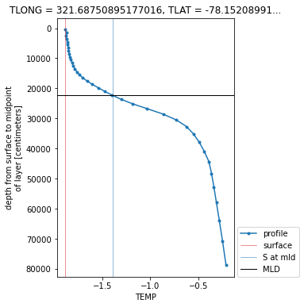

# How to Use `xarray.map_blocks` for Vertical Interpolation of a 3D Field

Within this example, we cover how to use `xarray.map_blocks` to calculate the mixed-layer depth within the CESM POP model output.

This calculation is "embarassingly parallel" such that each calculation is done within a single a column. The calculation **_should_** be easily computed within each column across the model domain. This is where `map_blocks` can be used to improve the performance of this metric.

## Imports and Data Ingestion

We use the following libraries/packages within this example

```python
import os

from scipy import interpolate
import numpy as np
import xarray as xr

import matplotlib.pyplot as plt

import pop_tools
```

Next, we read in the data using `xarray` and subset for temperature and salinity, subsetting for a smaller portion of the domain for testing purposes

```python
ds = xr.merge((
    xr.open_dataset('/glade/p/cgd/oce/projects/cesm2-marbl/xpersist_cache/3d_fields/TEMP-presentday-monclim.nc', chunks={}),
    xr.open_dataset('/glade/p/cgd/oce/projects/cesm2-marbl/xpersist_cache/3d_fields/SALT-presentday-monclim.nc', chunks={}),
))


ds = ds[['TEMP', 'SALT']].persist()

# subset for testing purposes
ds = ds.isel(member_id=slice(0, 2), nlat=slice(2, 5), nlon=slice(1, 5))
```

## Data Operation

Next, we setup a function to compute the mixed layer depth (MLD). The MLD is defined as the point in the water column where the potential density (`sigma`) exceeds the surface density by a specified threshold (`dsigma`).

```python
def mld_dsigma(SALT, TEMP, dsigma=0.03, rho_chunks={'nlat': 16, 'nlon': 16}):
    """
    Compute MLD based on ∆σ criterion. Uses xarray.map_blocks.

    Parameters
    ----------

    SALT : xarray.DataArray
      Salinity
    TEMP : xarray.DataArray
      Potential temperature
    dsigma : float, optional
      The value for ∆σ.
    rho_chunks: dictionary, optional
      Dimension chunk parameters to chunk rho by

    Returns
    -------

    MLD : xarray.DataArray
      The MLD (m) defined as the point in the water column where
      density exceeds rho[0] + dsigma.
    """

    # determine dimensionality
    dims_in = SALT.dims
    assert dims_in == TEMP.dims, 'dimension mismatch'
    assert 'z_t' in SALT.coords, 'z_t not found in SALT coords'

    # drop ancillary coordinates
    SALT = SALT.reset_coords(drop=True)
    TEMP = TEMP.reset_coords(drop=True)

    # compute density - this is where there is a tradeoff in using a "core dimension" for chunking
    rho = pop_tools.eos(SALT.chunk({'z_t': 10}),
                        TEMP.chunk({'z_t': 10}),
                        depth=SALT.z_t * 0.).compute()

    # add these coordinates which creep in somewhere, I think when xarray does the unstack
    # without these, I get an error: not expecting {'nlat', 'nlon'}
    # chunking here is arbitrary and maybe suitable for the global POP_gx1v7 grid
    if 'nlat' in rho.dims and 'nlon' in rho.dims:
        rho = rho.assign_coords({
            'nlat': xr.DataArray(np.arange(len(SALT.nlat)), dims=('nlat')),
            'nlon': xr.DataArray(np.arange(len(SALT.nlon)), dims=('nlon')),
        })

    # Compute density - this will help the workflow from being "bogged down" with too many tasks
    rho = rho.chunk(rho_chunks).persist()

    # Setup a template
    template = rho.isel(z_t=0).drop('z_t')
    template.attrs['long_name'] = 'MLD'
    template.attrs['units'] = SALT.z_t.attrs['units']
    template.name = 'MLD'

    # compute and return MLD - this is where the parallelization comes in
    return xr.map_blocks(
        interp_mld_dsigma, rho,
        kwargs=dict(dsigma=dsigma),
        template=template,
    )
```

### Applying Mixed Layer Depth Calculation

This function, `interp_mld_dsigma` is designed to be called within `xr.map_blocks`. It assumes that `rho_in` has a depth dimension, `z_t` and some number of unspecified other dimensions, `non_vertical_dims`.

The `non_vertical_dims` are "stacked" using `xarray.stack` and the code loops over these dimensions, performing linear interpolation in `z_t` at each location.

The data are returned unstacked with the dimensions ordered as they arrived in `rho_in`.

We define the function here, then immediately call it to test it; arbitrarily, we're calling it on TEMP rather than density.

```python
def interp_mld_dsigma(rho_in, dsigma=0.03):
    """compute MLD at point using interpolation"""

    non_vertical_dims = [d for d in rho_in.dims if d not in ['z_t']]
    rho_stack = rho_in.stack(non_vertical_dims=non_vertical_dims)
    mld_stack = xr.full_like(rho_stack.isel(z_t=slice(0, 1)), fill_value=np.nan)
    N = rho_stack.sizes["non_vertical_dims"]
    z_t = rho_in.z_t

    for i in range(N):
        # if all NaN, skip this column
        if rho_stack[:, i].isnull().all():
            continue

        # if the whole column has density less than the threshold, set MLD to deepest point
        if (rho_stack[:, i] < rho_stack[0, i] + dsigma).all():
            k = np.where(~np.isnan(rho_stack[:, i]))[0]
            mld_stack[:, i] = z_t[k[-1]]

        # linearly interpolate
        else:
            f = interpolate.interp1d(
                rho_stack[:, i], z_t,
                assume_sorted=False,
            )
            mld_stack[:, i] = f(rho_stack[0, i] + dsigma)

    return mld_stack.unstack().isel(z_t=0, drop=True).transpose(*non_vertical_dims)

# simulate what happens in map_blocks
subset_to_singletons = dict(nlat=slice(0, 1), nlon=slice(0, 1), member_id=slice(0, 1), month=slice(0, 1))

dsigma=0.5
temp_depth = interp_mld_dsigma(ds.TEMP.isel(subset_to_singletons).reset_coords(drop=True), dsigma=dsigma)
```

## Visualize the Output

Here's a plot of the MLD diagnosed using TEMP by the linear interpolation method above.

```python

plt.figure(figsize=(4, 6))

ds.TEMP.isel(subset_to_singletons).T.plot(y='z_t', marker='.', label='profile')

plt.axvline(ds.TEMP.isel(subset_to_singletons).isel(z_t=0),
            linewidth=0.5, c='tab:red', label='surface')

plt.axvline(ds.TEMP.isel(subset_to_singletons).isel(z_t=0)+dsigma,
            linewidth=0.5, c='tab:blue', label='S at mld')

plt.axhline(temp_depth*1e2, linewidth=1., c='k', label='MLD')

plt.legend(loc=(1.02, 0));
ylm = plt.ylim()
plt.ylim(ylm[::-1]);
```



## Running this on the Entire Dataset

Now let's put everything together, running the `mld_dsigma` calculation on the "full" dataset (note that it is still subset given the smaller domain mentioned previously).

```python
%%time
mld = mld_dsigma(ds.SALT, ds.TEMP).compute()
```

This process takes ~2 seconds. Currently, this implementation takes 18 minutes to compute `mld_sigma` for the entire spatial domain for a single ensemble member. Further posts will investigate using `xarray.apply_unfunc` in this context, comparing the performance and tradeoffs.

## Potential opportunities for improvements

When working through these computations, it is important to use the dask dashboard to determine where there are bottlenecks within the analysis.

Also, it can be helpful to understand the nature of the computation. In this case, this computation is considered to CPU heavy, so the key is increasing the number cores being utilized, using a line like this at the beginning:

```python
# Increase # of threads, more compute heavy
cluster = ncar_jobqueue.NCARCluster(cores=8, processes=4, memory='80 GB', project='project_number')
cluster.scale(jobs=10)
client = Client(cluster)
```

Another method of optimization could be increasing/decreasing the chunksize within the `mld` function

```python
mld = mld_dsigma(ds_whole.SALT, ds_whole.TEMP, rho_chunks={'nlat': 16*2, 'nlon': 16*2}).compute()
```

There are no clear correct answers here - it will depend on the specific use case, and the nature of the computation, but hopefully these starting points will help!
