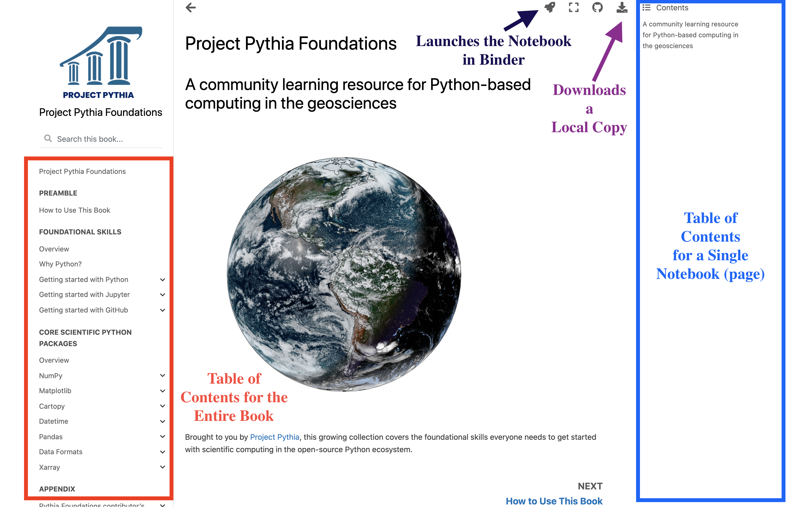
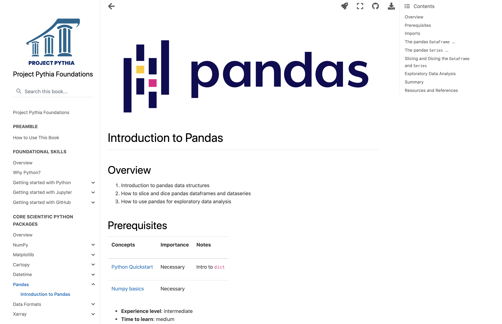
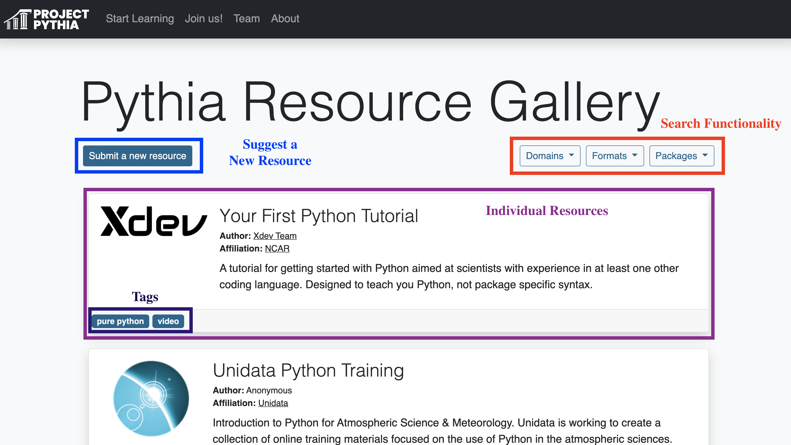

# Project Pythia Portal Overview

Last year, the Project Pythia team was formed to "... provide a public, web-accessible training resource that will help educate current, and aspiring, earth scientists to more effectively use both the Scientific Python Ecosystem and Cloud Computing to make sense of huge volumes of numerical scientific data."

The team is formally a collaboration between three main organizations, although contributors come from thoughout the Python ecosystem:

- The National Center for Atmospheric Research (NCAR)
- University at Albany
- Unidata

Last month, the [Project Pythia Team](https://projectpythia.org/index.html#the-project-pythia-team) presented progress on the project at the Earthcube Annual Meeting, the major milestones being the development of the [Foundations Book](https://foundations.projectpythia.org/landing-page.html) and the [Resource Gallery](https://projectpythia.org/gallery.html)

## Header section

The main landing page for Project Pythia is known as the ["Pythia Portal"](https://projectpythia.org/index.html#).

The main page provides an overview of the project, including the motivation and a summary of what the goals of this project are. If you scroll down the page

## Start Learning

The next section is ["Start Learning"](https://projectpythia.org/index.html#start-learning) which is where both the [Foundations Book](https://foundations.projectpythia.org/landing-page.html) and the [Resource Gallery](https://projectpythia.org/gallery.html) can be accessed.

### [Foundations Book](https://foundations.projectpythia.org/landing-page.html)

The [Foundations Book](https://foundations.projectpythia.org/landing-page.html) is one of the major milestones that the Project Pythia team has accomplished thus far. This is the place to go if you are looking for content related to foundational Python for Geoscience materials.

Clicking on the link on the Pythia Portal will take you to the JupyterBook containing the instructional material - this can also be accessed using [foundations.projectpythia.org](https://foundations.projectpythia.org/landing-page.html)

Once within the [Foundations Book](https://foundations.projectpythia.org/landing-page.html), you will see the typical [Jupyterbook](https://jupyterbook.org/intro.html) interface with a few primary sections

Each notebook is its own "page", separated into sections outlined in the table of contents which can be found along the left sidebar. On the right side of the page is the table of contents for a single notebook, which is determined using the header information in each notebook. This can be useful when wanting to navigate to specific section of a notebook.

These notebooks are executable - which is what makes this [Jupyterbook](https://jupyterbook.org/intro.html) interface so useful! If you select the space ship button near the top of the page, the notebook will open up on [binder](https://mybinder.org/) which enables you interactively run the Jupyter Notebook on whichever device you are using - even including a mobile device (yes, you run this on your cell phone browser).

If you would like to download a local copy of the notebook, select the download button in the top right corner, and select whether to download as a `PDF` or `ipynb` (notebook).

Within the foundational content notebooks, you will find that each notebook follows the same format, including the following sections:

- Overview - a brief overview of what is covered in that notebook
- Prerequisites - what material is required before diving into the content
- Desired experience level - the difficulty level of the notebook
- Time to learn - estimated time to complete notebook
- The actual content - which often includes imports, and several headings (ex. `The Pandas Dataframe`)
- Summary - main takeaways from the notebook
- What's next - what is covered in additional notebooks in that section
- Resources and references - data references, where to find more resources

### [Resource Gallery](https://projectpythia.org/gallery.html)

The [Resource Gallery](https://projectpythia.org/gallery.html) includes links to a variety of external (to Project Pythia) material that is useful to the Geoscience community! This is a great place to go if you are looking for additional training materials or more specific examples or galleries.

If you continue scrolling down the page, you will find various ways to contribute and engage with the project, including via [Github Discussions](https://github.com/ProjectPythia/projectpythia.github.io/discussions) and by [contributing](https://projectpythia.org/contributing.html)!

