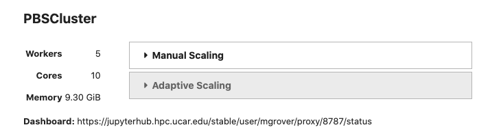
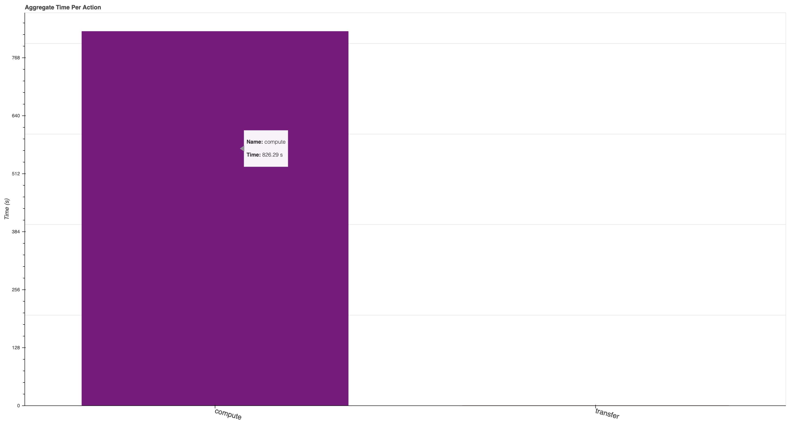

# Scaling Python with Dask Class Takeaways

This week, I had the opportunity to attend the [Scaling Python with Dask](https://coiled.io/scaling-python-with-dask/) class offered by [Coiled](https://coiled.io/). The class provided an overview of a variety of topics, including:

- Parellelizing Python Code
- Dask Dataframe
- Dask Array
- Scaling Your Own Code
- Graphical User Interfaces - dashboards!
- Machine Learning Applications
- Distributed Dask
- Basic Operation of Dask Clusters
- Tasks
- Distributed Data
- Resource Usage and Resilience
- Debugging
- A Use Case Example using Machine Learning
- Best Practices

The class was structured such that each day, we used the JupyterLab interface and resources on AWS to interact with the different notebooks (where the content was all presented). The class was four hours long per day, with four days of instruction.

## Overview of Dask and Dashboards

### Introduction + What/Why Dask

The first day of the tutorial provided an overview of the class, and what we would cover during the week. Our instructor, [Adam Briendel](https://github.com/adbreind), mentioned the history of scaling systems, specifically in the context of distributed systems.

- Through the end of the 1900s, processors continued to improve speed, but recently, processor speed has flatlined
  - Instead, we look to add more processors
- An issue has come up though - what if your dataset is too large to fit into memory (ex. multiple terabyte climate model output)

This is where [Dask](https://dask.org) comes in - embedded within the Python ecosystem, especially the Scientific Python ecosystem, Dask works to simplify the complex process that is distributed computing!

It may be helpful to read more documentation on [why Dask](https://docs.dask.org/en/latest/why.html) within their docs!

### Overview of the Cluster

The two main components of setting up up dask are your `Cleint` which is the main API within `dask-distributed`, and the `Cluster`, which has a generally **weak** definition, since there are numerous `Cluster`s you could use including

- [**`NCARCluster`**](https://github.com/NCAR/ncar-jobqueue) - Easiest to use on NCAR Computing Resources
  - Utilizes [`dask-jobqueue`](<(https://jobqueue.dask.org/en/latest/index.html)>) underneath
- [**`PBSCluster`**](https://jobqueue.dask.org/en/latest/generated/dask_jobqueue.PBSCluster.html)
  - Which is one `Cluster` from [`dask-jobqueue`](https://jobqueue.dask.org/en/latest/index.html)
- [`YarnCluster`](https://yarn.dask.org/en/latest/)
- [`KubeCluster`](https://kubernetes.dask.org/en/latest/)

Once you spin up your cluster, you wrap it in the `Cluster` (ex. `Cluster(cluster)`), since the `Client` is what works as the interface between your code and the cluster

A typical block of code on Casper would look like:

```python
from ncar_jobqueue import NCARCluster
from dask.distributed import Client

cluster = NCARCluster(memory='2GB', processes=1)
cluster.scale(5)
client = Client(cluster)
```

### Looking at the Dashboard

Once the `Cluster` and `Client` are setup, you can view the dashboard for your setup. This can be accessed by clicking the link next to `Dashboard` as shown below



There are a few default graphs you can look at, including the two main

- Task stream (each row is a worker, the colors represent specific tasks)
- Progress (overview of tasks that are scheduled, which are completed)
- Bytes per worker (how much data is stored on each worker, lighter shades represent "spilled to disk")

If you are interested in other graphs, check out the [full list of options on the Dask documentation](https://distributed.dask.org/en/latest/http_services.html)

One that I found particularly helpful during the week was `individual-aggregate-time-per-action`, which is accessible by adding "individual-aggregate-time-per-action" to the end of your dashboard

- ex. `https://jupyterhub.hpc.ucar.edu/stable/user/mgrover/proxy/8787/individual-aggregate-time-per-action`

This dashboard shows a comparison between compute vs. transfer, which can be helpful when optimizing the time spent computing vs. moving data around

An "idealized" case is shown below where most of the time is spent computing



## Introduction to Distributed Computing

One of the most valuable components of this class was the overview of distributed computing, with a deep dive into [the journey of a task](https://distributed.dask.org/en/latest/journey.html)

This is a piece that is often missing in "best practices" documentation. While it is not important for all users to be an expert in distributed computing practices, or the theory of it, it is important to have a general understanding of what it is, and how it useful for your own data.

Often times, a person's first introduction to Dask is simply importing, and applying to your code. It is **essential** to have a general understanding of how tasks are scheduled, and how the different components talk with each other. The main components include:

- Client - what the user interfaces with
  - Takes in your code (individual tasks)
- Cluster - includes the following
  - Scheduler - what schedules the individual tasks (sends to the workers)
  - Workers - the virtual machines that actually run the work (viewable within the dashboard)
  - Nanny - look over the workers, make sure that if one of them dies, they are restarted

## Best Practices

Best practices can be difficult to define, since data workflows vary substantially depending on the discipline. One of the main lessons learned throughout the week was how to use the dashboard to check on your code and see where things could be inefficient.

### Xarray + Dask Best Practices

The Xarray community has put together [some fanastic documentation](https://xarray.pydata.org/en/stable/user-guide/dask.html#optimization-tips) on Dask optimization, which is a common place people in the geoscience community interface with Dask

A good thing to keep in mind is making sure that you are optimizing the `chunks` (dask arrays) or `partitions` (dask dataframes) for your data. You want to make sure that your chunks are not too big such that they take up too much memory in your workers, while also making them large enough such that you do not have too many tasks which can lead to "task scheduling overhead".

### Saving data

It is recommended that you save data in "chunking" friendly formats (ex. `zarr`, `hdf5`) to allow for parallel writing/reading. One of the largest pieces of slowdown/inefficiency is not reading data in parallel at the beginning of your workflow, as well as chunking your data properly. These data formats help to solve this issue!

## Conclusion

This class was fantastic. This deep dive into Dask and distributed computing in general provided a deeper understanding that one can struggle to gather from typical online documentation. If you have any questions about it, be sure to reach out to the [Coiled team](https://coiled.io/) about other course offerings or [myself](https://mgrover1.github.io/) if have specific questions about my experience taking the class.
